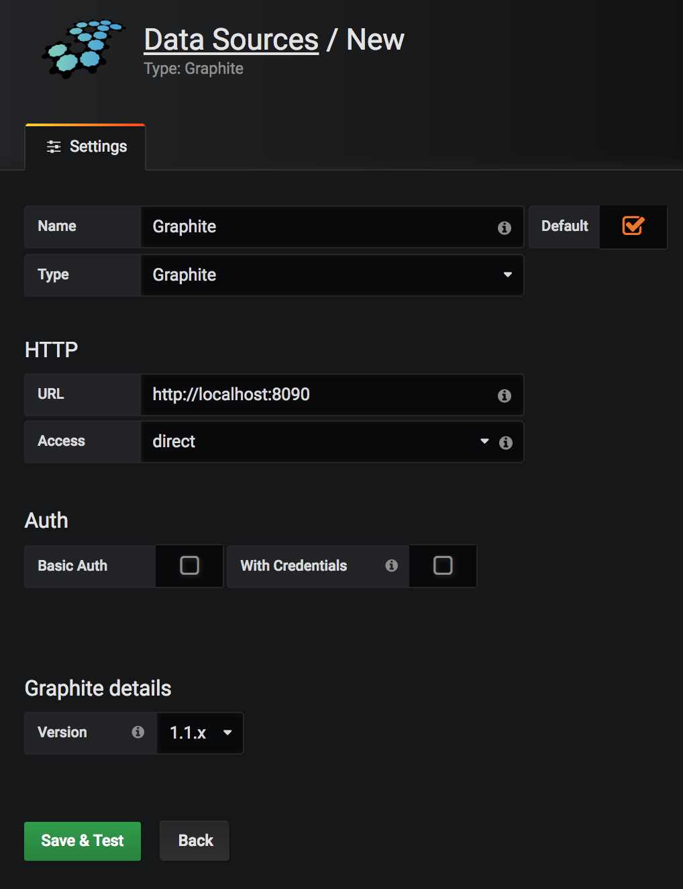

## Docker Compose
Dado que vamos a usar imágenes docker para el tp entero, incluido el profiling, hay que usar `docker-compose up` para ejecutar todo.

En el tp1, tenemos 1 instancia de Node, 1 instacia de Node con 3 workers (Usando `cluster`), 1 instancia de Gunicorn con un único worker, 1 instancia de Gunicorn con 3 workers y, según el siguiente comando, 3 instancias de Gunicorn cuya carga será repartida por Nginx. Para poder ejecutar los containers:

```
docker-compose up --scale n-gunicorn=3
```

Y si no se creó un usergroup docker para que no sea necesario ejecutarlo como root, hay que ejecutar el comando con `sudo`: `sudo docker-compose up --scale n-gunicorn=3`

Tener cuidado que si se quiere escalar algún otro container, hay que modificar el archivo `nginx_reverse_proxy.conf` que está en este directorio (si hay dudas, revisar a dónde apunta la configuración de nginx en `docker-compose.yml`) para hacer de load balancer.

### Monitoring
Una vez que se tiene corriendo el Docker Compose, además de las apps mencionadas anteriormente, levanta una serie de servicios útiles para el monitoring de las mismas. Entre ellas se encuentra Grafana y cAdvisor, cuyas interfaces pueden ser accedidas mediante `http://localhost` y `http://localhost:8080`. Allí podremos encontrar diversas métricas y gráficos útiles para hacer analytics de la performance de los containers.

#### Grafana
Esta herramienta necesita una pequeña configuración para poder funcionar. Primero, es necesario setearle un data source (Es decir, de dónde va a tomar los datos). En nuestro caso, dentro del Docker Compose se levanta Graphite que es quien se encargará de dicha tarea. Entonces, es necesario que al ingresar a Grafana (Notar que si pide un usuario y contraseña éstos son "admin" y "admin" respectivamente), agregar el data source correspondiente.

Al clickear en "Add data source", completarlo de la siguiente manera:



Una vez hecho esto, se puede, desde el botón de `+`, crear un dashboard o bien importarlo. Por ejemplo, se puede importar el archivo `.json` como, por ejemplo, `dashboard-light.json`, que ya provee una serie de gráficos sobre las distintas apps que hay dentro del Docker Compose.

**Nota:** Es importante que el nombre del data source coincida con el que está especificado en el archivo `.json`

## Nginx

`nginx` es un reverse proxy y load balancer. Para poder utilizarlo, es necesario instalarlo en la máquina. Desde Mac, se puede hacer mediante el manejador de paquetes `brew` (`brew install nginx`) y desde Ubuntu (o similares) con `apt` (`apt-get install nginx`).

Una vez instalado, se puede levantar fácilmente con el comando `nginx`. En nuestro caso, para no utilizar la configuración default (Que se encuentra, en Mac, en `/usr/local/etc/nginx/nginx.conf`), vamos a utilizar la configuración que se encuentra en el archivo `nginx.conf` de esta carpeta. Entonces ejecutamos:

```bash
nginx -p . -c nginx.conf
```

Este mismo comando se encuentra en el script `./nginx.sh`.

Además, provee algunas facilidades para "restartearlo" mediante el uso de señales:

```bash
nginx -s reload
```

Así como se usa la misma metodología para cerrarlo:

```bash
nginx -s quit
```